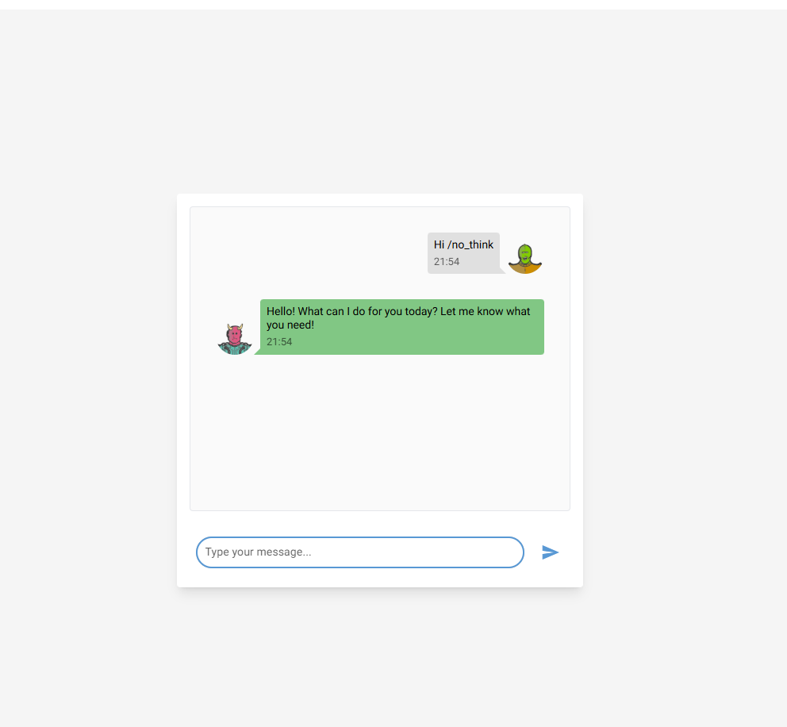

<h1>Generative AI Project Template</h1>


[](https://www.python.org/downloads/release/python-3120/)
[](https://www.debian.org/)
[](#)

[](#)
[](https://pytorch.org/get-started/locally/)
[](#)

[](#)
[](#)

[](https://github.com/charliermarsh/ruff)
[](#)
[]()
[](#)
[](#)
[](#)

Template for a new AI Cloud project.

Click on [<kbd>Use this template</kbd>](https://github.com/aminedjeghri/generative-ai-project-template/generate) to start your own project!


This project is a generative ai template. It contains the following features: LLMs, information extraction, chat, rag & evaluation.
It uses LLMs(local or cloud), NiceGUI (frontend) & FastAPI (backend) & Promptfoo as an evaluation and redteam framework for your AI system.

| Test LLM                                            |
|-----------------------------------------------------|
|  |

**Engineering tools:**

- [x] Use UV to manage packages in a workspace (`frontend` and `backend`).
- [x] pre-commit hooks: use ``ruff`` to ensure the code quality & ``detect-secrets`` to scan the secrets in the code.
- [x] Logging using loguru (with colors)
- [x] Pytest for unit tests
- [x] Dockerized project (Dockerfile & docker-compose).
- [x] NiceGUI (frontend) & FastAPI (backend)
- [x] Make commands to handle everything for you: install, run, test

**AI tools:**

- [x] LLM running locally with Ollama or  in the cloud with any LLM provider (LiteLLM)
- [x] Information extraction and Question answering from documents
- [x] Chat to test the AI system
- [x] Efficient async code using asyncio.
- [x] AI Evaluation framework: using Promptfoo, Ragas & more...

**CI/CD & Maintenance tools:**

- [x] CI/CD pipelines: ``.github/workflows`` for GitHub (Testing the AI system, local models with Ollama and the dockerized app)
- [x] Local CI/CD pipelines: GitHub Actions using ``github act``
- [x] GitHub Actions for deploying to GitHub Pages with mkdocs gh-deploy
- [x] Dependabot ``.github/dependabot.yml`` for automatic dependency and security updates

**Documentation tools:**

- [x] Wiki creation and setup of documentation website using Mkdocs
- [x] GitHub Pages deployment using mkdocs gh-deploy plugin


Upcoming features:
- [ ] add RAG again
- [ ] optimize caching in CI/CD
- [ ] [Pull requests templates](https://docs.github.com/en/communities/using-templates-to-encourage-useful-issues-and-pull-requests/creating-a-pull-request-template-for-your-repository)
- [ ] Additional MLOps templates: https://github.com/fmind/mlops-python-package
- [ ] Add MLFlow
- [ ] add Langfuse


## Project Structure and Technologies

- **Frontend:**
  Built with **React** (see `frontend/`). This is the user-facing web application.

- **API:**
  The backend API is built with **FastAPI** (see `api/`). This serves as the main backend for the app, handling authentication, business logic, and data.

- **Backend (ML/AI):**
  The backend will also implement and serve **machine learning models** (e.g., for generative AI, embeddings, etc.), either locally or via cloud providers.

---

## Environment Variables

### Frontend

The frontend expects the following environment variables (typically in `frontend/.env.dev` or similar):

- `REACT_APP_BACK_API_URL`
  The base URL for the backend API (e.g., `http://localhost:8000`).

- `REACT_APP_STRIPE_PUBLISHABLE_KEY`
  The Stripe publishable key for payment integration.

You may need to add more depending on your deployment (e.g., analytics, Sentry, etc.).

### API

The API backend (in `api/`) expects the following environment variables (see `docker-compose.dev.yml`, `api/main.py`, and `api/routes.py`):

- `BACKEND_HOST` (default: `0.0.0.0`)
  - Host for the FastAPI server.
- `BACKEND_PORT` (default: `8000`)
  - Port for the FastAPI server.
- `FAST_API_SECRET_KEY`
  - Secret key for JWT authentication.
- `SECRET_KEY`
  - Secret key for other cryptographic operations (used in routes).
- `STRIPE_SECRET_KEY`
  - Stripe secret key for payment processing.
- `STRIPE_WEBHOOK_SECRET`
  - Stripe webhook secret for validating Stripe webhooks.
- `FRONT_END_URL`
  - The URL of the frontend app (used for CORS and redirects).

### Backend (ML models)

The backend expects the following environment variables (see `docker-compose.dev.yml` and backend code):

- `BACKEND_HOST` (default: `0.0.0.0`)
  Host for the FastAPI server.
- `BACKEND_PORT` (default: `8000`)
  Port for the FastAPI server.
- `OLLAMA_MODEL_NAME`
  Name of the LLM model to use with Ollama.
- `OLLAMA_EMBEDDING_MODEL_NAME`
  Name of the embedding model to use with Ollama.
- `INFERENCE_DEPLOYMENT_NAME`
  Name of the inference deployment.
- `INFERENCE_BASE_URL`
  Base URL for inference API (e.g., `http://ollama:11434`).
- `INFERENCE_API_KEY`
  API key for inference service.
- `EMBEDDINGS_DEPLOYMENT_NAME`
  Name of the embeddings deployment.
- `EMBEDDINGS_BASE_URL`
  Base URL for embeddings API.
- `EMBEDDINGS_API_KEY`
  API key for embeddings service.
- `UV_PROJECT_ENVIRONMENT`
  Path to the backend virtual environment.
- `PYTHONUNBUFFERED`
  Set to `1` to ensure Python output is not buffered (useful for logging in Docker).

You may also need to set up database URLs, secret keys, and other service credentials as required by your deployment.

---

## 1. Getting started
This project is a monorepo containing two main packages:

- `frontend`: A [NiceGUI](https://nicegui.io/) application.
- `backend`: A [FastAPI](https://fastapi.tiangolo.com/) application that serves the AI models and business logic.

The project uses `uv` as a package manager and is configured as a workspace, so dependencies for both packages can be installed with a single command.

The following files are used in the contribution pipeline:

- ``.env.example``: example of the .env file.
- ``.env`` : contains the environment variables used by the app.
- ``Makefile``: contains the commands to run the app locally.
- ``Dockerfile``: the dockerfile used to build the project inside a container. It uses the Makefile commands to run the app.
- ``.pre-commit-config.yaml``: pre-commit hooks configuration file
- ``pyproject.toml``: The root `pyproject.toml` defines the `uv` workspace and shared development dependencies.
- `frontend/pyproject.toml`: Dependencies for the frontend application.
- `backend/pyproject.toml`: Dependencies for the backend application, including optional dependencies for `cpu` and `cuda`.
- `.github/workflows/**.yml`: GitHub actions configuration files.
- `.gitlab-ci.yml`: Gitlab CI configuration files.
- ``.gitignore``: contains the files to ignore in the project.

Tree:

```
.
├── .env.example # example of the .env file
├── .env # contains the environment variables
├── Dockerfile # the dockerfile used to build the project inside a container. It uses the Makefile commands to run the app.
├── docker-compose.yml # docker-compose configuration file (used to run the frontend and backend in docker)
├── Makefile # contains the commands to run the app (like running the frontend, tests, installing packages, docker...)
├── assets
├── pyproject.toml # uv, dependencies, pytest, ruff & other configurations for the package
├── uv.lock # uv lock file
├── .pre-commit-config.yaml # pre-commit hooks configuration file
├── .gitignore # contains the files to ignore in the project
├── .github
│   ├── dependabot.yml # dependabot configuration file
│   └── workflows # GitHub actions configuration files
│       └── test-deploy.yaml
├── mkdocs.yml # mkdocs configuration file
├── uv.lock
├── frontend
│   ├── pyproject.toml    # Frontend dependencies
│   └── src/
├── backend
│   ├── pyproject.toml    # Backend dependencies (including cpu/cuda extras)
│   └── src/
├── .pre-commit-config.yaml
├── .gitignore
├── .github/
├── scripts
│   └── gen_doc_stubs.py # mkdocs : generate documentation stubs
├── CODE_OF_CONDUCT.md
├── CONTRIBUTING.md
├── README.md
├── LICENSE
└── tests/
```


### 1.1. Local Prerequisites

- Ubuntu 22.04 or MacOS
- git clone the repository
- UV & Python 3.12 (will be installed by the Makefile)
- Create a ``.env`` file *(take a look at the ``.env.example`` file)*


### 1.2 ⚙️ Steps for Installation
This project uses a `Makefile` to simplify the installation and execution process.

#### Local Installation
1. **For CPU-based environment (or MacOS)**
   To install all dependencies for both `frontend` and `backend` for a CPU environment, run:
   ```bash
   make install-dev
   ```

2. **For NVIDIA GPU (CUDA) environment**
   If you have an NVIDIA GPU and want to use CUDA for acceleration, run:
   ```bash
   make install-dev-cuda
   ```
   This will install the CUDA-enabled version of PyTorch.

#### Using Docker
The project can be fully containerized using Docker. This is the recommended way to run the application as it handles all services and networks.
- The `docker-compose.yml` and `docker-compose-cuda.yml` files define the services.
- To build the main docker image:
  ```bash
  make docker-build
  ```
- To run the entire application stack (frontend, backend, database, Ollama) using Docker Compose:
  ```bash
  make run-app
  ```

#### Running the Application
Once installed (either locally or via Docker), you can run the services.

- **Run Everything:**
  The `make run-app` command is the easiest way to start all services, including the frontend, backend, database, and Ollama.

- **Run Services Individually:**
  - **Run Frontend:** `make run-frontend`
  - **Run Backend:** `make run-backend`

You can then access:
- Frontend (NiceGUI): [http://localhost:8080](http://localhost:8080) (or the configured port)
- Backend (FastAPI): [http://localhost:8000](http://localhost:8000) (or the configured port). Docs [http://localhost:8000/docs](http://localhost:8000/docs)

#### Using Local vs. Cloud LLMs
- **Local model (Ollama)**:
    - Ensure Ollama is running (`make run-ollama` can help).
    - Set your `.env` file to point to the local Ollama endpoint.
    - Download a model: `make download-ollama-model`
    - Test the connection: `make test-ollama`
- **Cloud model (OpenAI, Anthropic, etc.)**:
    - Update your `.env` file with the correct API keys and model names, following the [LiteLLM naming convention](https://docs.litellm.ai/docs/providers).
    - Test the connection: `make test-inference-llm`

### 1.3 ⚙️ Steps for Installation (Contributors and maintainers)
Check the [CONTRIBUTING.md](CONTRIBUTING.md) file for more information.

## 2. Contributing
Check the [CONTRIBUTING.md](CONTRIBUTING.md) file for more information.
